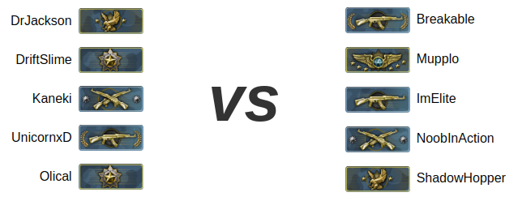

# matchmaker

This tool helps the [TAW.net][] CS:GO division to build (fairly) balanced teams for our regular training games. It's written in [ClojureScript][].

To use it, you'll need to go to the Google sheet containing all TAW.net CS:GO division members and ranks. You need to copy the columns including the names and ranks then paste it into the textbox on the page.

You'll also need to copy and paste today's attendance from a TAW.net event page. Literally select the lines including names and if they "attended" or not, then paste that into the other textbox.

It works it out from the garbled text you just pasted which is quite convenient.

It will build as many teams as possible, but some people won't fit in a 10 player game, so they are left at the bottom of the page as the "remainder".

## Development

Since this is written in ClojureScript you'll need [leiningen][] to work on it. You can install it through your package manager.

Be sure not to edit the `docs` directory by hand. This is the compiled output, you should edit `src` and `public` instead. It needs to be in git for GitHub pages to work.

 * `make dev` - Start the development ([figwheel][]) server, you'll need to open `public/index.html` via `file://`.
 * `make release` - Compile everything for release. You'll have to commit the new JavaScript to release it.

## Author

[Oliver Caldwell][author-site] ([@OliverCaldwell][author-twitter])

## Unlicenced

Find the full [unlicense][] in the `UNLICENSE` file, but here's a snippet.

>This is free and unencumbered software released into the public domain.
>
>Anyone is free to copy, modify, publish, use, compile, sell, or distribute this software, either in source code form or as a compiled binary, for any purpose, commercial or non-commercial, and by any means.

Do what you want. Learn as much as you can. Unlicense more software.

[taw.net]: http://taw.net/
[clojurescript]: http://clojurescript.org/
[unlicense]: http://unlicense.org/
[author-site]: http://oli.me.uk/
[author-twitter]: https://twitter.com/OliverCaldwell
[leiningen]: http://leiningen.org/
[figwheel]: https://github.com/bhauman/lein-figwheel[]
